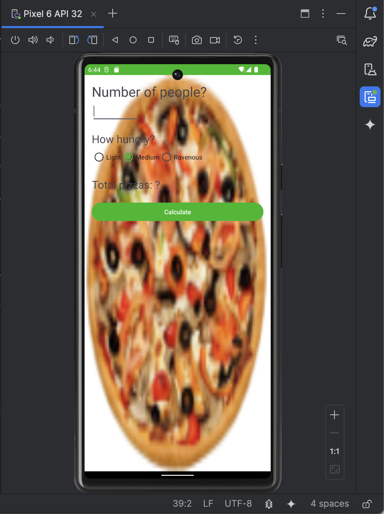
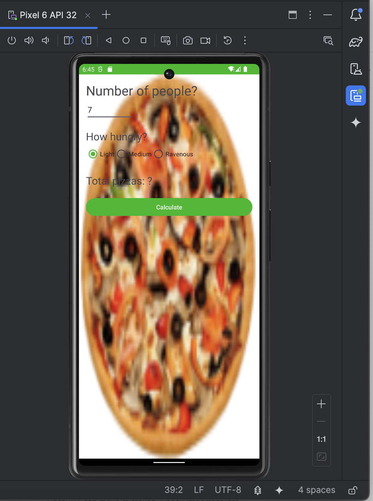
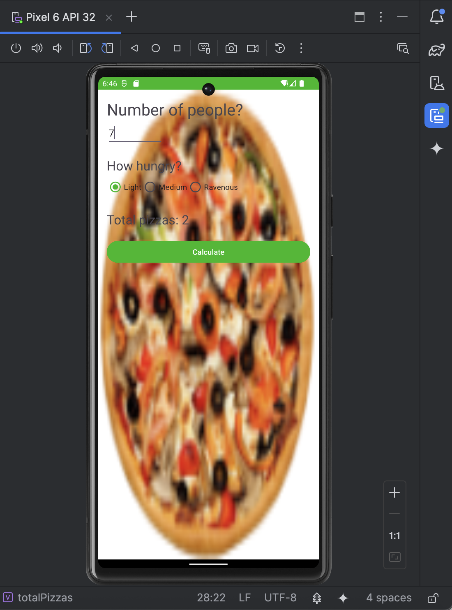

# 🍕 Pizza Party App

A simple Android application that helps determine how many pizzas are needed for a group of people.  
The user enters the number of attendees, selects how hungry they are, and the app calculates the total pizzas required.

---

## 📌 Features
- Enter number of people attending the party  
- Choose hunger level: **Light**, **Medium**, or **Ravenous**  
- Automatic pizza calculation based on slices per pizza  
- Displays total pizzas needed  
- Saves the calculation on rotation (using `onSaveInstanceState`)

---

## 🧮 How the Calculation Works
Each hunger level corresponds to a number of slices per person:

| Hunger Level | Slices per Person |
|--------------|------------------|
| Light        | 2 slices         |
| Medium       | 3 slices         |
| Ravenous     | 4 slices         |

One pizza = **8 slices**

The formula:

total pizzas = ceil(people * slices_per_person / slices_per_pizza)

---

## 📱 Screenshots

### **1. Main screen when the app loads**

### **2. User enters number of people and selects hunger level**

### **3. After pressing Calculate — total pizzas displayed**

---

## 🏗️ Tech Used
- Kotlin  
- Android Studio  
- Activity lifecycle (`onSaveInstanceState`)  
- Custom calculation logic (`PizzaCalculator` class)

---
